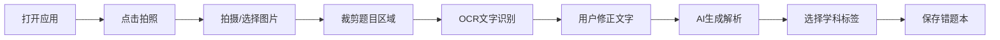

## 1. 产品概述

智能错题本是一款面向个人用户的移动端 PWA 应用，通过拍照上传错题照片，利用 OCR 文字识别 + AI 大模型自动生成答案和详细解析，帮助用户高效整理错题、科学复习。

- **核心价值**：告别手抄错题，AI 一键录入，智能复习巩固
- **目标用户**：学生、自学者等有错题整理需求的个人用户
- **使用场景**：做题后拍照录入、通勤时复习错题、考前集中刷题

## 2. 核心功能

### 2.1 用户角色

| 角色 | 注册方式 | 核心权限 |
|------|----------|----------|
| 个人用户 | 无需注册，本地使用 | 拍照录题、查看解析、错题管理、复习练习 |

### 2.2 功能模块

1. **首页（错题本）**：错题统计概览、学科分类入口、最近添加错题
2. **拍照录入**：拍照/选图 → 裁剪确认 → OCR 识别 → AI 生成解析 → 保存归档
3. **错题详情**：题目展示、答案解析、原题图片、编辑标签
4. **复习模式**：艾宾浩斯复习提醒、错题练习、已掌握标记
5. **我的/设置**：数据备份导出、AI 配置、关于信息

### 2.3 页面详情

| 页面名称 | 模块名称 | 功能描述 |
|----------|----------|----------|
| 首页 | 统计卡片 | 展示错题总数、待复习数、今日新增、掌握率 |
| 首页 | 学科分类 | 按学科筛选错题（数学、英语、物理、化学等） |
| 首页 | 最近错题 | 瀑布流/列表展示最近录入的错题卡片 |
| 拍照录入 | 拍照/选图 | 调用相机拍照或从相册选择图片 |
| 拍照录入 | 图片裁剪 | 可旋转、裁剪题目区域 |
| 拍照录入 | OCR识别 | 上传图片识别文字，可手动修正 |
| 拍照录入 | AI解析 | 调用大模型生成答案和详细解析 |
| 拍照录入 | 保存归档 | 选择学科、添加标签、保存到错题本 |
| 错题详情 | 题目展示 | 题目文字 + 原题图片对照 |
| 错题详情 | 答案解析 | 分步骤解析，可折叠展开 |
| 错题详情 | 操作按钮 | 标记掌握、编辑、删除、加入复习 |
| 复习模式 | 复习列表 | 按艾宾浩斯曲线展示今日需复习的题 |
| 复习模式 | 练习模式 | 遮住答案，先做题再看解析 |
| 复习模式 | 掌握标记 | 答对标记已掌握，答错加入再复习 |
| 我的 | 数据管理 | 导出备份、导入恢复、清空数据 |
| 我的 | AI 设置 | 配置 OCR 和大模型 API Key |
| 我的 | 应用信息 | 版本号、添加到主屏幕引导 |

## 3. 核心流程

### 3.1 错题录入流程

用户打开应用 → 点击拍照按钮 → 拍摄或选择错题图片 → 裁剪调整题目区域 → OCR 自动识别文字 → 用户可修正识别结果 → AI 生成答案和解析 → 用户选择学科/添加标签 → 保存到本地错题本

### 3.2 复习流程

用户进入复习页 → 查看今日待复习题目 → 点击开始练习 → 先看题目自己思考 → 点击显示答案 → 自我评估（掌握/未掌握） → 系统更新复习时间

## 4. 用户界面设计

### 4.1 设计风格

- **设计调性**：学习感 + 科技感，清新明亮、专注高效
- **主色调**：深靛蓝 `#1e3a8a`（智慧、专注）
- **辅助色**：青绿色 `#10b981`（正确、成长）、琥珀色 `#f59e0b`（提醒、待复习）、珊瑚红 `#ef4444`（错误、重点）
- **背景色**：浅灰蓝 `#f8fafc` 为主，卡片纯白 `#ffffff`
- **按钮风格**：圆角 12px，微渐变填充，点击有缩放反馈
- **字体**：系统字体优先（苹方/思源黑体），标题加粗，正文清晰易读
- **布局风格**：卡片式布局，底部 Tab 导航，内容区留白充足
- **图标风格**：线性图标 + 少量填充，简约现代

### 4.2 页面设计概览

| 页面名称 | 模块名称 | UI 元素 |
|----------|----------|---------|
| 首页 | 顶部状态栏 | 日期问候语、设置图标 |
| 首页 | 统计概览 | 4个渐变统计卡片（总数、待复习、今日新增、掌握率） |
| 首页 | 学科标签 | 横向滚动的学科胶囊标签 |
| 首页 | 错题列表 | 错题卡片（科目标签、题目摘要、添加时间、掌握状态） |
| 首页 | 悬浮按钮 | 右下角圆形拍照按钮，带脉冲动画 |
| 拍照录入 | 顶部导航 | 返回、标题、下一步 |
| 拍照录入 | 图片区域 | 全屏展示图片，支持双指缩放、拖拽裁剪框 |
| 拍照录入 | 底部工具栏 | 旋转、重选、裁剪确认 |
| 拍照录入 | 识别结果 | 文字编辑框，可手动修改 |
| 拍照录入 | AI 生成中 | 加载动画 + 进度提示 |
| 拍照录入 | 解析结果 | 答案区、解析区，卡片式分块 |
| 错题详情 | 顶部图片 | 原题图片缩略，点击放大 |
| 错题详情 | 题目内容 | 题目文字，大号字体 |
| 错题详情 | 答案解析 | 折叠面板，点击展开分步解析 |
| 错题详情 | 标签区域 | 学科标签 + 自定义标签 |
| 错题详情 | 底部操作栏 | 标记掌握、编辑、删除 |
| 复习模式 | 顶部进度 | 今日复习进度条 |
| 复习模式 | 题目卡片 | 翻转卡片效果（正面题目，背面答案） |
| 复习模式 | 底部按钮 | 已掌握 / 再复习 |
| 我的 | 用户区域 | 头像占位、使用天数统计 |
| 我的 | 功能列表 | 数据备份、AI 设置、关于等列表项 |

### 4.3 响应式

- **移动优先**：以 375px 宽度为基准设计，向上兼容
- **适配范围**：支持 320px ~ 768px 宽度的手机屏幕
- **触控优化**：按钮最小点击区域 44x44px，列表项高度 ≥ 48px
- **安全区适配**：适配 iPhone 刘海屏、底部小黑条

### 4.4 动效设计

- **页面转场**：左右滑动切换，带渐隐效果
- **卡片悬浮**：轻微上浮 + 阴影加深
- **拍照按钮**：呼吸光晕动画，吸引点击
- **翻转卡片**：3D 翻转效果展示答案
- **加载状态**：骨架屏 + 进度条，减少等待焦虑
