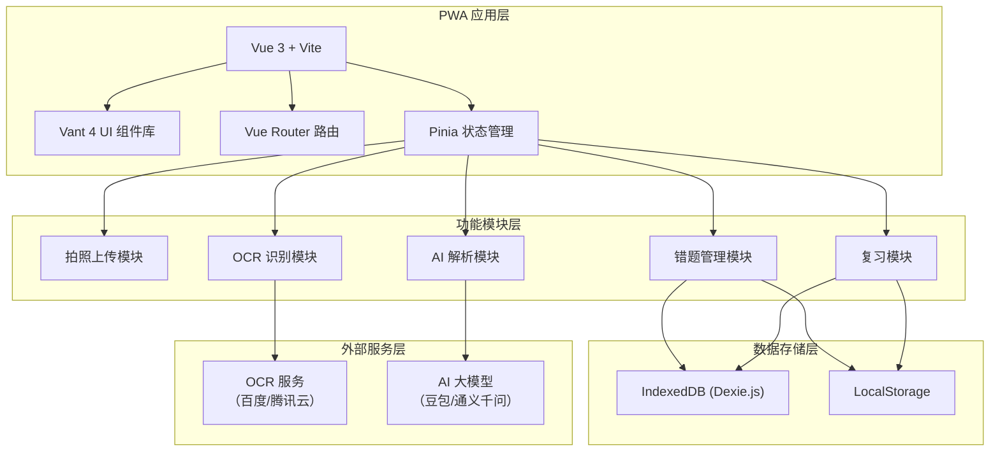
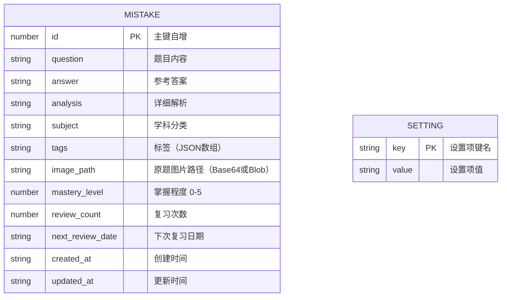

## 1. 架构设计

## 2. 技术说明

- **前端框架**：Vue 3.4 + Composition API + `<script setup>`
- **构建工具**：Vite 5.x
- **UI 组件库**：Vant 4（移动端专业组件库）
- **路由管理**：Vue Router 4
- **状态管理**：Pinia
- **PWA 支持**：vite-plugin-pwa
- **本地数据库**：IndexedDB + Dexie.js
- **HTTP 客户端**：Axios
- **图片处理**：Canvas API（裁剪、压缩）
- **后端服务**：无（纯前端应用，数据本地存储）
- **外部 API**：OCR 服务 + 大模型 API（用户自行配置 Key）

## 3. 路由定义

| 路由路径 | 页面名称 | 说明 |
|----------|----------|------|
| `/` | 首页（错题本） | 错题统计、学科分类、错题列表 |
| `/capture` | 拍照录入 | 拍照/选图、裁剪、OCR、AI解析 |
| `/detail/:id` | 错题详情 | 题目展示、答案解析、操作 |
| `/review` | 复习模式 | 今日待复习、练习模式 |
| `/mine` | 我的页面 | 数据管理、AI配置、关于 |
| `/settings/ai` | AI 设置 | 配置 OCR 和大模型 API |

## 4. 数据模型

### 4.1 数据模型定义

### 4.2 IndexedDB 表结构

**mistakes 表（错题表）**

| 字段 | 类型 | 说明 | 索引 |
|------|------|------|------|
| id | Number | 主键，自增 | PRIMARY |
| question | String | 题目文字内容 | |
| answer | String | 参考答案 | |
| analysis | String | 详细解析 | |
| subject | String | 学科分类 | 普通索引 |
| tags | String | 标签 JSON 字符串 | |
| imageData | String | 图片 Base64 | |
| masteryLevel | Number | 掌握程度 0-5 | 普通索引 |
| reviewCount | Number | 复习次数 | |
| nextReviewDate | String | 下次复习日期 ISO | 普通索引 |
| lastReviewDate | String | 上次复习日期 ISO | |
| createdAt | String | 创建时间 ISO | |
| updatedAt | String | 更新时间 ISO | |

**settings 表（设置表）**

| 字段 | 类型 | 说明 |
|------|------|------|
| key | String | 主键，设置项键名 |
| value | String/Object | 设置项值 |

### 4.3 设置项说明

| Key | 类型 | 默认值 | 说明 |
|-----|------|--------|------|
| ocrProvider | String | 'baidu' | OCR 服务提供商 |
| ocrApiKey | String | '' | OCR API Key |
| ocrSecretKey | String | '' | OCR Secret Key |
| aiProvider | String | 'doubao' | AI 大模型提供商 |
| aiApiKey | String | '' | AI API Key |
| aiModel | String | '' | AI 模型名称 |
| subjects | Array | [...] | 学科列表 |
| reviewInterval | Array | [1,2,4,7,15] | 艾宾浩斯复习间隔（天） |

## 5. 艾宾浩斯复习算法

- 掌握等级 0（新题）：1 天后复习
- 掌握等级 1：2 天后复习
- 掌握等级 2：4 天后复习
- 掌握等级 3：7 天后复习
- 掌握等级 4：15 天后复习
- 掌握等级 5：已掌握，不再自动复习

每次复习后：
- 标记"已掌握"：掌握等级 +1，更新下次复习时间
- 标记"未掌握"：掌握等级重置为 0，1 天后再复习

## 6. 图片存储策略

由于 IndexedDB 存储限制，采用以下策略：
1. 拍照/选图后压缩至最大宽度 1080px，JPEG 格式质量 0.8
2. 图片以 Blob 形式存储在 IndexedDB
3. 展示时通过 URL.createObjectURL 生成临时 URL
4. 单题图片预计 100-300KB，可存储数千道错题
